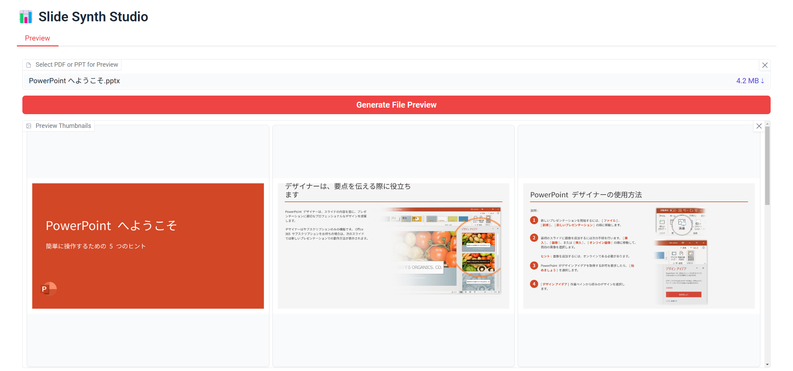
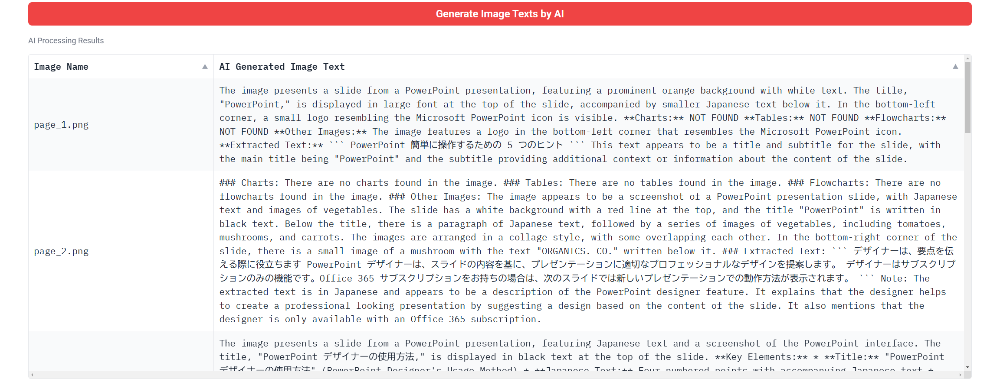
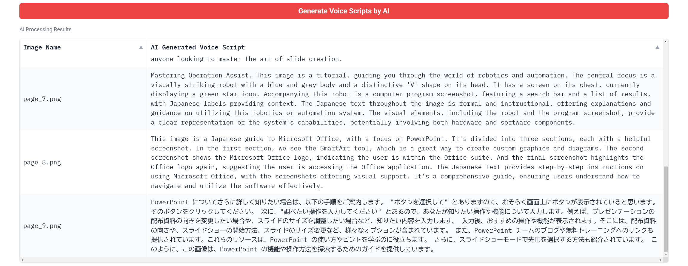
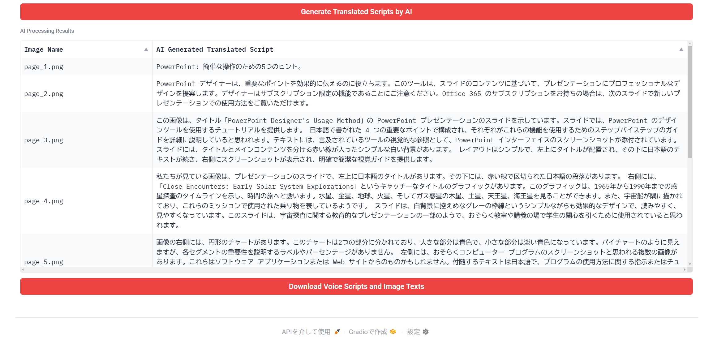

# Slide Synth Studio 🎥🗣️

## 🚀 Quick Start

### Prerequisites
- Ubuntu 24.04+ (Recommended)
- Python 3.11+
- LibreOffice 7.0+
- FFmpeg (For upcoming video features)

### Installation
```bash
# Clone repository
git clone https://github.com/engchina/slide-synth-studio.git
cd slide-synth-studio

# Install system dependencies
sudo apt install libreoffice libjpeg-dev zlib1g-dev

# Setup Python environment
pip install -r requirements.txt
# pip list --format=freeze > requirements.txt
```

### Preview







